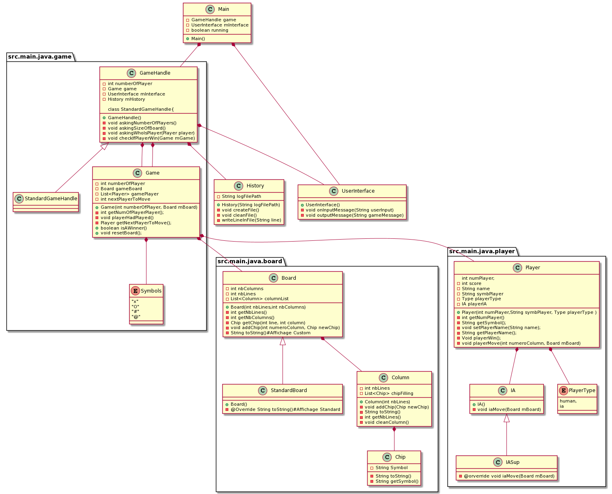

# PG220
Le but de projet est de créer un jeu de puissance 4 dans le terminal.

# Diagramme :

# Equipe :
Dream team

# Membres :
 Pierre-Louis Transon
   pltranson@yahoo.fr
 Thibaut Robinet
   thibaut.robinet@outlook.fr
 Zachary Scialom
   zscialom@enseirb-matmeca.fr
   
# Prof: 
Jonathan Narboni:
  jonathan.narboni@labri.fr4
