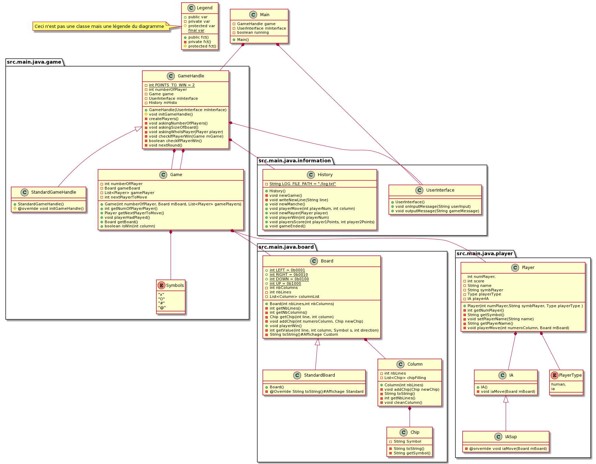

# PG220
Le but de projet est de créer un jeu de puissance 4 dans le terminal.

# Diagramme :

# Remarque :
Il nous semble qu'un des tests n'est pas juste :
test game_error_invalid_column_full.sc log has failed starting at line:9
line: "Joueur 1 joue 1" has not been found

En effet nous ne comprenons pas pourquoi "Joueur 1 joue 1"  devrait être ajouté à l'historique alors que la colonne est pleine et que le joueur ne peut donc plus jouer dans cette colonne.

# Equipe :
Dream team

# Membres :
 Pierre-Louis Transon
   pltranson@yahoo.fr
 Thibaut Robinet
   thibaut.robinet@outlook.fr
 Zachary Scialom
   zscialom@enseirb-matmeca.fr
   
# Prof: 
Jonathan Narboni:
  jonathan.narboni@labri.fr4
